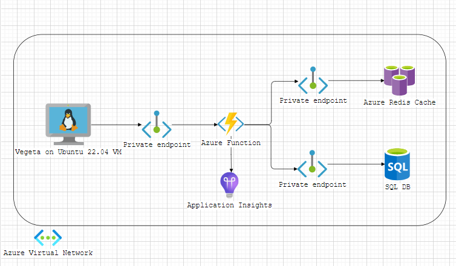

# How many requests will my API support in production?
That is the question that has bugged IT professionals ever since.  
Two main variables (obviously) determine the answer:
- what hardware you'll be using
- the scalability of the software you'll be writing

Whereas the second factor is difficult to determine, you can work on the first, and try to know what are the upper limits of the first.

This site would like to give you some data to help taking these decisions: 
- _what pricing tier is needed to sustain a certain number of API calls?_
- _should I use a single powerful service, or more smaller services?_
- _is Linux better than Windows_?
- _what cloud provider is more cost-effective_?

Our journey starts with these technologies:
- Azure Functions on App Service Plans (both Linux and Windows)
- .NET workloads

## What did we find with Azure Functions?
Nothing that we did not expect: more expensive Azure Functions guaranteed better performance.  
However, how better and how expensive suprised us in some cases.

## How we measured Azure Functions
This very repo hosts (in the /src folder) a .NET 7 isolated process project. 
That project uses three types of APIs to determine the upper limits of Azure Functions
- APIs that only handle in memory objects, without dependencies on other resources (the basic APIs)
- APIs that on purpose waste some time before returing an answer
- (more realistic) APIs that read and write data from a Redis Cache and a SQL DB \[the result parsing of these is a WIP]

## What can you do with these results?
Even though your software and dependencies can be _very_ different from those we tested here, this exercise can give you an idea of the upper limit you will not be able to exceed even if your software is perfect. We believe it's already something to help you in your decisions, isn't it? 

## The infrastructure / architecture we tested
We tested all of the Azure Function production-ready tiers available in West Europe (S\*, P\*V2, P\*V3) in both OSs available (Linux and Windows).
The client machine generating the load was a 64 GB / 8 CPU Ubuntu 22.04 VM.
The Azure functions were in the same virtual network of the VM via private endpoints.
Also the Azure Redis Cache and the SQL Database were in the same network, on different subnets. This is an architectural drawing of the solution:  
.
You can download the original diagrams.net (formerly draw.io) drawing <a href="https://github.com/RiccardoGMoschetti/API-sault/blob/0309d506e0a3876d8de130dd95a27e126fe9ea6b/docs/Architecture_ApiSault_Functions_on_Azure.drawio">here</a>.

## The load tools we used
We used <a href="https://github.com/tsenart/vegeta">Vegeta</a>, a simple yet reliable tool which can easily generate a big amount of concurrent calls. We used the version 12.8.3 as the latest did not seem to have been built for ARM64.

## What is better, Linux or Windows?
They are very similar, except for the P2 tier, where Windows is much better. However, Linux is cheaper. If your application is stateless, more Linux resources can give you better performance at lower prices.

## Now, some results
For every tier of the available Azure Functions, Vegeta gave us the following information:
- minimum value (which we ignored)
- mean (which we ignored)
- 50th percentile (which we consider more interesting than the mean, as the latter is more influenced by outliers)
- 90th percentile
- 95th percentile
- 99th percentile
- maximum value (which we ignored as well)

For our purposes, a test is _passed_ at a certain rate when, for ten minutes straight, more than 98% of the requests are fullfilled and the 95th percentile for that rate takes less or equal to 999 milliseconds to reply. 999 milliseconds can be considered a lax paramater; take into consideration that this test is supposed to give you the _higher_ limit of the infrastructure, which your users won't hopefully encouter continuously.
In this test, we did not use B tiers of app functions, as they are not reported as production ready by Microsoft.

### "S" tiers

Upper limits were testing by deploying to the Functions a very basic API (/api/SimpleJson) that does the follow:
- it creates an object in memory with a GUID and a randorm string
- it serializes the object and gives it back to the client.

We believe any API must do _at least_ this (and a lot more). So, this can be considered the absolute upper limit for your needs.
These were the results for Linux Functions (prices in April 2023):

| *Tier*      | CPUs   | RAM    | Storage| Price/Month |*Max requests/s*|   
|-------------|--------|--------|--------|-------------|----------------|
| *Linux S1*  |      1 | 1.75 GB|   50 GB|          64 |           *75* |
| *Linux S2*  |      2 | 3.50 GB|   50 GB|         128 |          *150* | 
| *Linux S3*  |      4 | 7.50 GB|   50 GB|         256 |          *300* |

These were the results for Windows Functions:

| *Tier*         | CPUs   | RAM    | Storage| Price/Month |*Max requests/s*|   
|----------------|--------|--------|--------|-------------|----------------|
| *Windows  S1*  |      1 | 1.75 GB|   50 GB|          67 |          *100* |
| *Windows  S2*  |      2 | 3.50 GB|   50 GB|         135 |          *200* | 
| *Windows  S3*  |      4 | 7.50 GB|   50 GB|         270 |          *500* |

From this picture you can already gather these considerations:

- Windows workloads, in the S* tier, allow you more requests than Linux, at a slightly increased price. 

### "P*V2" tiers

These tiers are the second generation of "premium" app services.  
Compared to "S" tiers, they have more memory and perform much, much better. They should be your choice for most workloads.

These are the Linux P\*V2 functions:

| *Tier*        | CPUs   | RAM     | Storage| Price/Month |*Max requests/s*|   
|---------------|--------|---------|--------|-------------|----------------|
| *Linux P1V2*  |      1 |  3.50 GB|  250 GB|          78 |          *150* |
| *Linux P2V2*  |      2 |  7.50 GB|  250 GB|         156 |          *400* | 
| *Linux P3V2*  |      4 | 14.00 GB|  250 GB|         311 |          *750* |

These were the results for the Windows P\*V2 Functions:

| *Tier*        | CPUs   | RAM     | Storage| Price/Month |*Max requests/s*|   
|---------------|--------|---------|--------|-------------|----------------|
| *Windows P1V2*  |      1 |  3.50 GB|  250 GB|          78 |          *150* |
| *Windows P2V2*  |      2 |  7.50 GB|  250 GB|         156 |          *400* | 
| *Windows P3V2*  |      4 | 14.00 GB|  250 GB|         311 |          *750* |

## Summary: more cost-effectively tiers

